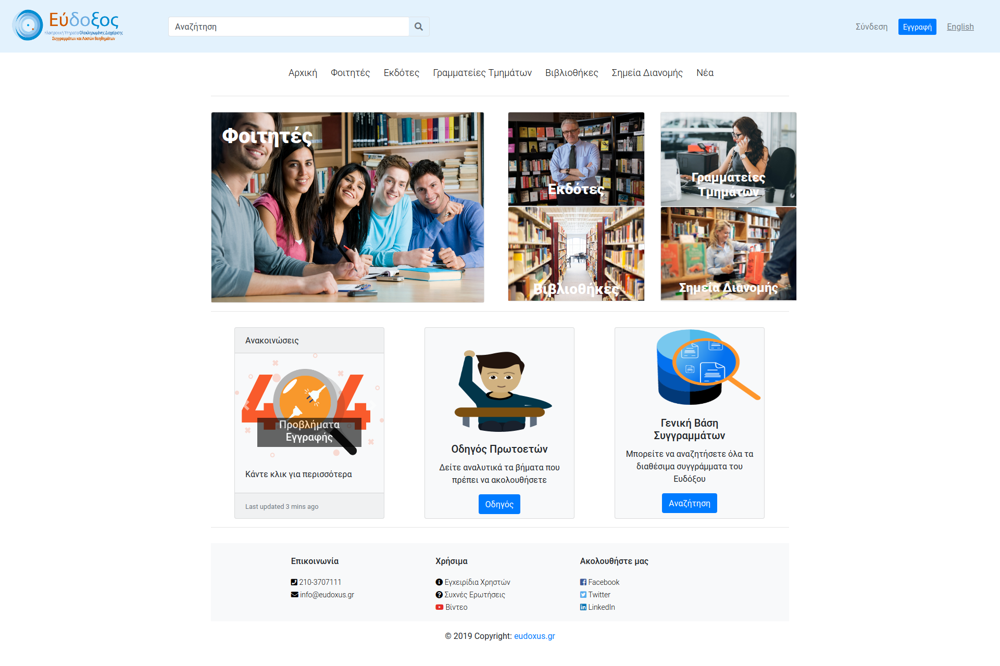
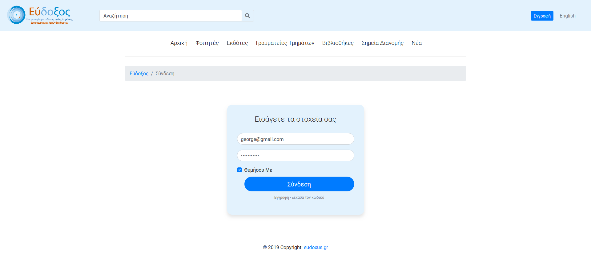
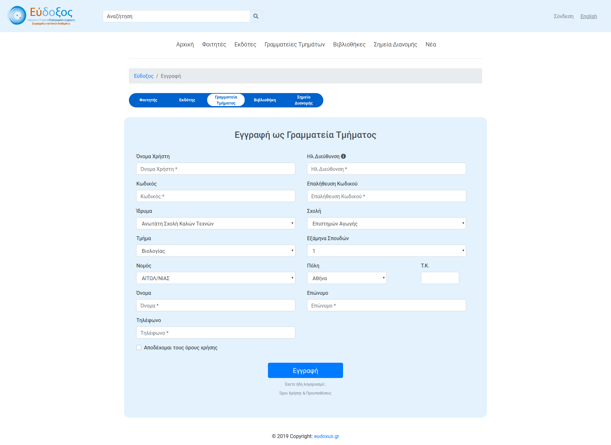
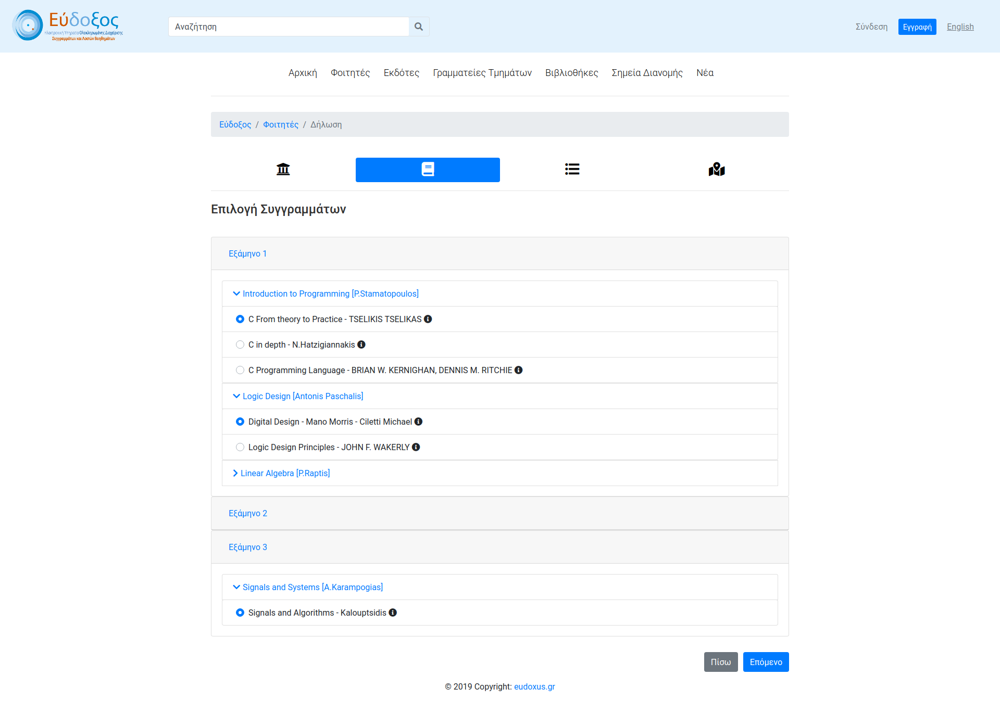
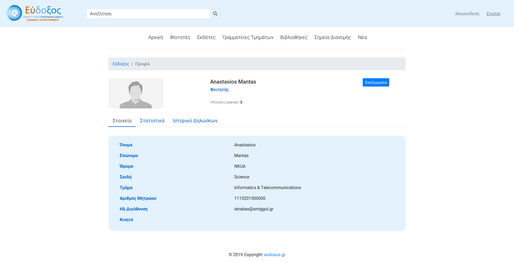
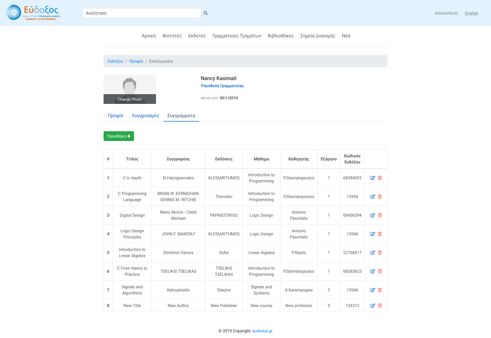

# Redesign Eudoxus

## About

We propose a brand new implementation of [eudoxus.gr](https://eudoxus.gr/) website. *Eudoxus* is an online platform for academic books management. It is used by students registered in Greek Universities , authors , publishers , University secretary offices e.t.c. Our main goal is to provide a much more pleasant as well as easier to learn interface while focusing on the usability and effectiveness of the website.   

## Built With

  * HTML/CSS/Bootstrap
  * PHP
  * JavaScript

## Contributors

  * George Michas [@geooo109](https://github.com/geooo109)
  * George Panagiotopoulos [@giorgospan](https://github.com/giorgospan)
  * Tasos Mantas

## Photos

Home Page

Sign in

Sign Up

Book statement (Selection)

Student Profile

Secretary Profile (Edit mode)

